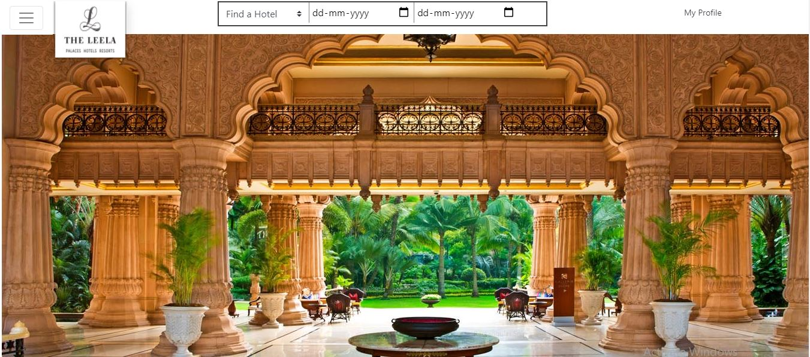
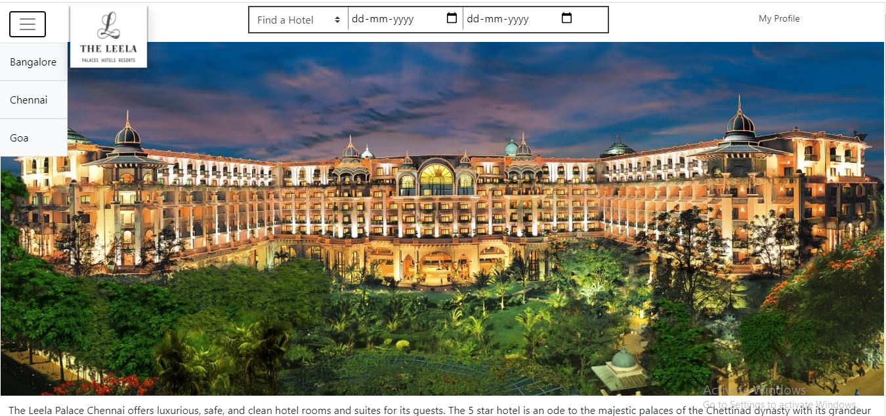
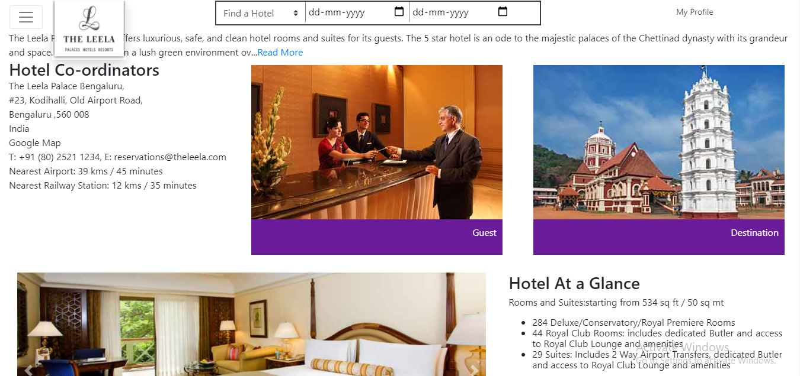
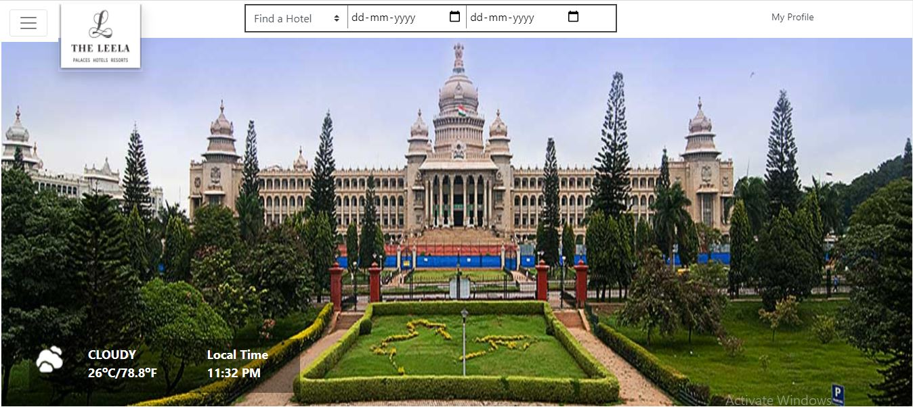
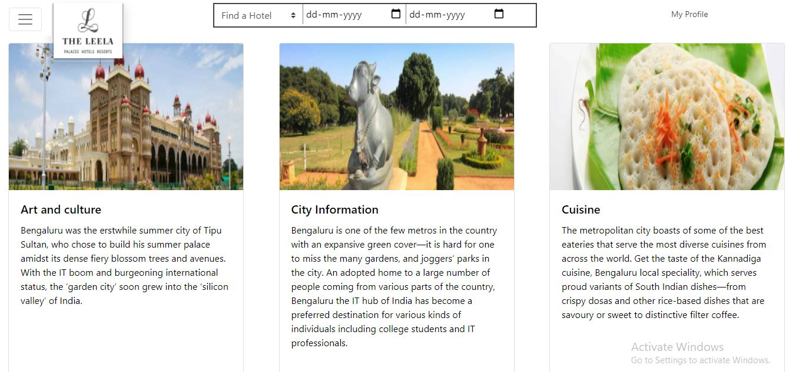
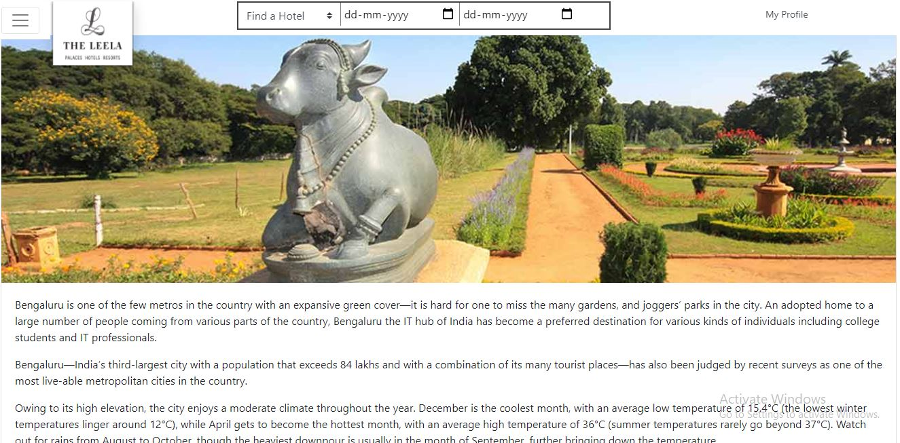

<h1>Leela palace</h1>
 
When we have Multiple Hotels at multiple places, The main task of the application is to access all the hotels in the single Application. I have mainly concentrated on React Routing DOM to travel from one location to another location

  
  <h1>Tech Stack Used</h1>
  

      
      
        
               
     

  
  <h1>Project WalkThrough</h1>
  
While We enter into the landing page in mainly goes to leelapalace Bangalore Page. From there We can select different location through the Nav button. i used Routing concepts to travel between the pages. I specifical did the<b> destination places</b> part for react routerDOM. I used UseParams hooks for accessing the correct params from the routing

  

  I have used styled components for CSS. 
  

 
here i have used airtable database so the details of different hotels will be stored in the database i ll access this using axios.

 <b>It first moves to the Bangalore Page from there we can move to multiple cities</b>
  
 
 <b>By using the nav Icon we can select the cities so that the routing will be takes place accordingly</b>
  
 
 <b> Then we can go through the destination places where we can spend the places and the details regarding the tourist spots</b>
 

 <b>Its the same destination landing page we can go through the areas what and all is available tourist places in the cities are available in this page</b>
 
 
 <b>There are multiple tourist spots available in the Specific City so that the viewers can go through and plan for the holidays with that specific areas</b>
 
 
 <b>This page gives the details regarding the Particular area of the city if there is any specification like historical places or any other important details will be specified in that page so that the viewers will get hang of that area and plan accordingly</b>
 
 
 
 
 
  
  
